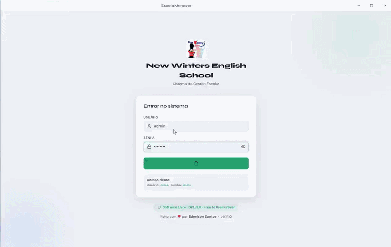

# 🎓 Escola Manager v5.15.3

Sistema desktop completo para gestão de escolas de idiomas.
**React 18 + Electron 29 + SQLite + PizZip · GPL-3.0 · Criado por Ednelson Santos**
[github.com/ednelsonsantos](https://github.com/ednelsonsantos)

---



---

## 🚀 Instalação

### Para usuários — Windows

1. Acesse a página de [Releases no GitHub](https://github.com/ednelsonsantos/escola-manager/releases/latest)
2. Baixe o arquivo `Escola Manager Setup x.x.x.exe` (coluna **Assets**)
3. Execute o instalador — clique em **Executar assim mesmo** se o Windows Defender SmartScreen alertar (o app não tem assinatura de código pago; é seguro)
4. O aplicativo será instalado e um atalho criado na área de trabalho
5. Na primeira execução, faça login com as credenciais padrão (veja tabela abaixo)

> **Requisito:** Windows 10/11 64-bit

### Para usuários — Linux

#### AppImage (qualquer distro)

1. Acesse a página de [Releases no GitHub](https://github.com/ednelsonsantos/escola-manager/releases/latest)
2. Baixe o arquivo `Escola Manager-x.x.x.AppImage` (coluna **Assets**)
3. Torne-o executável e rode:

```bash
chmod +x "Escola Manager-x.x.x.AppImage"
./"Escola Manager-x.x.x.AppImage"
```

> Em algumas distros é possível dar duplo clique no `.AppImage` direto no gerenciador de arquivos.

#### .deb (Ubuntu, Debian, Linux Mint e derivados)

1. Baixe o arquivo `escola-manager_x.x.x_amd64.deb` na página de Releases
2. Instale com:

```bash
sudo dpkg -i escola-manager_x.x.x_amd64.deb
# ou
sudo apt install ./escola-manager_x.x.x_amd64.deb
```

3. Abra pelo menu de aplicativos ou execute `escola-manager` no terminal

> **Requisito:** Linux 64-bit (kernel 4.4+) · glibc 2.17+

### Para desenvolvedores

```bash
# Instalar dependências do sistema (Ubuntu/Debian)
sudo apt-get install -y build-essential python3

npm install            # instala e recompila módulos nativos
npm run dev            # modo desenvolvimento
npm run build          # gera instalador .exe (Windows)
npm run build:linux    # gera .AppImage e .deb (Linux)
```

**Requisitos:** Node.js 18 ou 20 · npm 9+
- Windows: Windows 10/11 64-bit
- Linux: Ubuntu 20.04+ ou equivalente · `build-essential` · `python3`

---

## 🔐 Login — Credenciais padrão

| Usuário | Senha | Perfil |
|---|---|---|
| `admin` | admin123 | Administrador |
| `secretaria` | sec123 | Secretaria |
| `demo` | demo | Demonstração |

**Professores de teste** (criados com `seed_usuarios_prof.js`):

| Usuário | Senha | Professor vinculado |
|---|---|---|
| `carmen` | carmen | Carmen López |
| `james` | james | James Wilson |
| `Klaus` | Klaus | Klaus Fischer |

---

## 🏁 Começando do zero

1. **Configurações → Dados → Limpar todos os dados**
2. **Configurações → Escola** — nome, CNPJ, endereço
3. **Configurações → Identidade Visual** — logo, slogan
4. **Cursos → Nova Turma** — crie as turmas
5. **Alunos → Novo Aluno** — cadastre os alunos (defina o dia de vencimento de cada um)
6. **Financeiro → Gerar Mensalidades** — gere as cobranças
7. **Frequência** — registre chamadas por turma

---

## 📋 Módulos

| Módulo | O que faz |
|---|---|
| **Dashboard** | KPIs em tempo real, abas personalizadas por perfil de acesso |
| **Alunos** | Cadastro, ficha individual, histórico de pagamentos, paginação, lista de espera, dados de responsável |
| **Financeiro** | Mensalidades, encargos (multa+juros), desconto antecipado, boleto PDF, WhatsApp |
| **Cursos** | Turmas com barra de ocupação, professores |
| **Frequência** | Chamada por turma/aula, grid de aulas em cards horizontais (7/linha, responsivo), grupos por dia do calendário, substituição de professor com validação de conflito, relatório por perfil com filtro de data e calendário customizado, PDF |
| **Folha de Pagamento** | Geração mensal por professor — CLT recebe salário fixo com desconto proporcional por horas não cumpridas; PJ recebe por hora ministrada com atualização automática ao abrir o módulo |
| **Recados** | Criação, agendamento e envio de recados por secretaria/professor para alunos/turmas; leitura individual rastreada por `aluno_id` SQLite; `_criarLeituras` expande destinatários `turma` e `todos` para alunos individuais ativos |
| **Fluxo de Caixa** | Lançamentos manuais de entradas/saídas, gráfico mensal de barras, resumo por categoria |
| **Grade de Horários** | Grade visual semanal das turmas por dia da semana, cores por idioma |
| **Carga Horária** | Horas ministradas por professor com detalhamento por turma e exportação CSV |
| **Biblioteca** | Acervo de livros com CRUD, controle de exemplares disponíveis, empréstimos com data prevista e detecção automática de atraso, devolução com um clique, carteirinha de leitor em PDF (86×54 mm), histórico completo de emissões de carteirinhas com busca e filtro por tipo |
| **Notas** | Lançamento de notas por turma/período, cálculo automático de média e conceito, ata em PDF; **Visão Geral** com todas as turmas em abas, filtros por professor e período |
| **Reserva de Salas** | Gestão de espaços, reservas com detecção de conflito, calendário semanal |
| **Inadimplentes** | Lista filtrada de alunos com atraso, envio de cobrança via Recados e WhatsApp em lote |
| **Estoque** | Cadastro de materiais didáticos, movimentações com histórico, alertas de estoque mínimo |
| **Certificados** | Emissão individual e em lote de certificados de conclusão em PDF (A4 paisagem), template configurável, histórico de emissões |
| **Relatórios** | Financeiro, alunos, cursos e rematrículas — exportação CSV, PDF e XLSX |
| **Agenda** | Calendário mensal + lista de eventos |
| **Usuários** | Contas, perfis e permissões por módulo |
| **Log de Auditoria** | Histórico completo de todas as ações |
| **Configurações** | Escola, financeiro (encargos+desconto), aparência, backup |

---

## 📊 Dashboard por Perfil

Cada perfil vê apenas as abas relevantes ao seu papel:

| Perfil | Visão Geral | Financeiro | Pedagógico | Agenda |
|---|:---:|:---:|:---:|:---:|
| Administrador | ✅ | ✅ | ✅ | ✅ |
| Secretaria | ✅ | — | ✅ | ✅ |
| Professor | — | — | ✅ | ✅ |
| Financeiro | — | ✅ | — | ✅ |
| Visualizador | ✅ | — | — | ✅ |

Notificações de inadimplência e badges de cobrança só aparecem para perfis com acesso ao módulo Financeiro.

> **Privacidade financeira:** perfis sem `perm_financeiro` não visualizam mensalidades de alunos, salários/contratos de professores, receita, faturamento mensal nem valores de pagamento em nenhum módulo.

---

## 💰 Encargos Financeiros

Configure em **Configurações → Financeiro**.

| Configuração | Padrão | Comportamento |
|---|---|---|
| Multa por Atraso | 10% | Aplicada uma única vez no 1º dia de atraso |
| Juros por Atraso | 2%/mês | Proporcional por dia a partir do 2º dia |
| Desconto Antecipação | 5% | Aplicado ao confirmar pagamento antes do vencimento |

---

## 💚 Pagamento via Pix

Configure em **Configurações → Financeiro → Pagamento via Pix**.

- **Chave Pix** — e-mail, CPF, CNPJ, telefone ou chave aleatória
- **QR Code** — faça upload da imagem exportada do seu banco (PNG/JPG/SVG)
- Ambos aparecem automaticamente no boleto gerado para o aluno

---

## 📄 Geração de PDF

**Sem dependências externas** — usa `Electron.webContents.printToPDF()` nativamente.

| Local | PDF gerado |
|---|---|
| Financeiro → 📄 em cada linha | Boleto/Cobrança individual do aluno |
| Financeiro → "Relatório PDF" | Relatório mensal com KPIs e tabela |
| Relatórios → Aba Financeiro | Relatório financeiro do período |
| Relatórios → Aba Alunos | Lista completa de alunos |
| Frequência → Relatório | Frequência por aluno com progresso |
| Biblioteca → Carteirinha | Carteirinha de leitor 86×54 mm com logo da escola |
| Certificados | Certificado de conclusão A4 paisagem com template configurável |

---

## 💬 Cobrança via WhatsApp

Botão 💬 em cada linha pendente/atrasada no Financeiro. Abre `wa.me` com mensagem personalizada — sem servidor externo, sem API, sem custo.

Botão de WhatsApp também disponível na ficha do aluno para contato com responsável.

---

## 📊 Relatório de Rematrículas

Aba dedicada em **Relatórios → Rematrículas**. Detecta automaticamente 3 tipos de evento:

| Tipo | Como é detectado |
|---|---|
| **Mudança de turma** | Campo `turmaAnteriorId` diferente da turma atual |
| **Reativação** | Campo `dataReativacao` presente — aluno voltou de Inativo/Trancado |
| **Renovação** | Gap de 2+ meses sem pagamento seguido de retorno |

Clique em qualquer aluno para expandir a linha do tempo de eventos e o histórico de pagamentos. Exportação disponível em **XLSX, XLS e CSV** — geração do arquivo feita no próprio renderer via `PizZip`, sem dependências adicionais. O XLSX inclui 3 abas: Resumo (KPIs), Detalhado (eventos) e Pagamentos.

---

## 🧑‍🏫 Ausência do Professor

No módulo **Frequência**, ao abrir uma aula o professor pode marcar **"Professor ausente nesta aula"**. Um textarea de justificativa é exibido. Ao salvar:

- A ausência e o motivo são gravados na aula no SQLite
- Um recado automático com prioridade **Importante** é criado e enviado para a secretaria via módulo Recados
- O audit_log registra o evento com nível `aviso`
- Na reabertura da mesma aula, um badge **"Já notificado"** evita duplicação do recado

---

## 💾 Backup e Restauração

| Ação | Onde |
|---|---|
| Backup automático ao fechar | Configurações → Sistema → toggle |
| Backup manual JSON | Configurações → Dados → Exportar |
| Restaurar backup | Configurações → Dados → Restaurar Backup |
| Abrir pasta de backups | Configurações → Sistema → "📁 Abrir pasta" |

A partir da **v5.15.1**, o backup automático gera um **dump SQL puro** de todas as 26 tabelas quando `migradoSQLite=true` (`PRAGMA foreign_keys=OFF` + `DELETE` + `INSERT` por tabela em transaction). A restauração detecta o formato automaticamente e aceita tanto dump SQL quanto JSON legado.

Localização dos backups (últimos 10 mantidos automaticamente):
- **Windows:** `%APPDATA%\Escola Manager\backups\`
- **Linux:** `~/.config/Escola Manager/backups/`

---

## 👥 Perfis de Acesso

| Perfil | Dash | Alunos | Fin. | Cursos | Relat. | Agenda | Config | Usuários |
|---|:---:|:---:|:---:|:---:|:---:|:---:|:---:|:---:|
| Administrador | ✏️ | ✏️ | ✏️ | ✏️ | ✏️ | ✏️ | ✏️ | ✏️ |
| Secretaria | 👁️ | ✏️ | ✏️ | 👁️ | 👁️ | ✏️ | ❌ | ❌ |
| Professor | 👁️ | 👁️ | ❌ | 👁️ | ❌ | 👁️ | ❌ | ❌ |
| Financeiro | 👁️ | 👁️ | ✏️ | ❌ | ✏️ | ❌ | ❌ | ❌ |
| Visualizador | 👁️ | 👁️ | 👁️ | 👁️ | 👁️ | 👁️ | ❌ | ❌ |

---

## 🏗️ Estrutura do Projeto

```
escola-manager/
├── electron/
│   ├── main.js          # IPC handlers, janela, PDF, WhatsApp, backup/dump, scheduler de recados
│   ├── preload.js       # Bridge segura renderer ↔ main (contextBridge)
│   └── database.js      # SQLite: todas as tabelas, migrations, funções de negócio
├── src/
│   ├── utils/
│   │   └── pdfUtils.js        # Gerador HTML/CSS para PDF + enviarWhatsApp
│   ├── context/
│   │   ├── AppContext.jsx     # Dados (SQLite via IPC), backup/dump, encargos, restauração
│   │   ├── AuthContext.jsx    # Sessão, identidade visual e permissões
│   │   └── UsuariosContext.jsx
│   ├── pages/
│   │   ├── Dashboard.jsx      ├── Alunos.jsx         ├── EditarAluno.jsx
│   │   ├── Financeiro.jsx     ├── Cursos.jsx         ├── EditarTurma.jsx
│   │   ├── EditarProfessor.jsx├── Frequencia.jsx     ├── Relatorios.jsx
│   │   ├── Agenda.jsx         ├── EditarEvento.jsx   ├── Usuarios.jsx
│   │   ├── EditarUsuario.jsx  ├── EditarPerfil.jsx   ├── AuditLog.jsx
│   │   ├── Configuracoes.jsx  ├── Sobre.jsx
│   │   ├── FluxoCaixa.jsx     ├── GradeHorarios.jsx  ├── CargaHoraria.jsx
│   │   ├── Notas.jsx          ├── ReservaSalas.jsx   ├── Inadimplentes.jsx
│   │   ├── Estoque.jsx        ├── Certificados.jsx   ├── Biblioteca.jsx
│   │   └── Recados/
│   │       ├── Recados.jsx        # Painel admin/secretaria/professor
│   │       ├── RecadosAluno.jsx   # Painel aluno/responsável + hook badge (IDs SQLite)
│   │       ├── RecadosPage.jsx    # Página principal com filtros por perfil
│   │       └── useRecados.js      # Hooks: useRecados (admin) + useRecadosAluno (aluno)
│   └── style.css              # Design system (dark + light)
├── dev-runner.js        # Inicia Vite + Electron com porta real detectada
└── package.json
```

---

## 🗄️ Banco de Dados — Tabelas SQLite

| Tabela | Descrição |
|---|---|
| `perfis` | Perfis de acesso e permissões por módulo (`perm_*`) |
| `usuarios` | Contas de usuário com vínculo a `professores_db` via `professor_db_id` |
| `identidade` | Logo e nome da escola |
| `configuracoes` | Chave-valor de configurações globais |
| `audit_log` | Log completo de auditoria com módulo, ação, nível e detalhe |
| `professores_db` | Professores — schema v6 com tipo de contrato CLT/PJ, salários e carga horária |
| `turmas_db` | Turmas — schema v6 completo com idioma, horário, professor e capacidade |
| `alunos_db` | Alunos — schema v6 com `ls_id` (legado), `dia_vencimento`, dados de responsável, status Lista de Espera, múltiplas matrículas e desconto |
| `pagamentos_db` | Pagamentos — schema v6 com `valor_original`, `valor_multa`, `valor_juros`, `valor_desconto`, `dias_atraso` |
| `eventos_db` | Eventos de agenda — schema v6 completo |
| `aulas` | Aulas por turma com conteúdo, `professor_ausente`, `justificativa_ausencia` e `professor_id` (substituto) |
| `folha_pagamento` | Folha mensal por professor — tipo CLT/PJ, horas normais/extras, bruto, deduções, líquido, status (Aberta/Fechada/Paga) |
| `presencas` | Presenças por aula e aluno |
| `recados` | Recados com título, mensagem, prioridade, status e agendamento |
| `recados_destinatarios` | Destinatários de cada recado (aluno, turma, todos, etc.) com `referencia_id` SQLite |
| `recados_leituras` | Controle de leitura por `aluno_id` (FK → `alunos_db.id`) — migrado de `aluno_ls_id` na v5.15.2 |
| `fluxo_caixa` | Lançamentos de entrada/saída com categoria, valor, data e mês |
| `salas` | Espaços físicos com capacidade, descrição e recursos JSON |
| `reservas_sala` | Reservas com sala, responsável, horário, status e vínculo com turma |
| `notas` | Notas por aluno/turma/período — parcial, final, recuperação, conceito |
| `estoque_itens` | Itens do estoque com categoria, unidade, quantidade, mínimo e preços |
| `estoque_movimentos` | Histórico de entradas, saídas e ajustes de inventário |
| `certificados` | Certificados emitidos por aluno e turma, com campos de template e assinaturas |
| `biblioteca_livros` | Acervo de livros — título, autor, ISBN, editora, ano, categoria, localização, total/disponíveis |
| `biblioteca_emprestimos` | Empréstimos — livro, tomador (aluno/professor/outro), datas de empréstimo/prevista/devolução, status (ativo/devolvido/atrasado) |
| `biblioteca_carteirinhas` | Histórico de emissões de carteirinhas — nome, tipo, turma, validade, emitida_em, emitida_por |

---

## 📬 Módulo de Recados — IPC Channels

| Channel | Parâmetros | Descrição |
|---|---|---|
| `recados:listar` | `filtros, req` | Lista recados com filtros |
| `recados:paraAluno` | `{ aluno_id, turma_id }` | Recados recebidos por aluno (IDs SQLite) |
| `recados:naoLidos` | `{ aluno_id, turma_id }` | Contador de não lidos |
| `recados:salvar` | `dados, req` | Criar/editar rascunho ou agendar |
| `recados:enviar` | `{ id }, req` | Enviar recado imediatamente |
| `recados:marcarLido` | `{ recado_id, aluno_id }` | Marcar como lido (ID SQLite) |
| `recados:excluir` | `{ id }, req` | Excluir rascunho |

O scheduler de recados agendados roda a cada 60s via `setInterval` no `main.js`.

---

## 📚 Módulo de Biblioteca — IPC Channels

| Channel | Parâmetros | Descrição |
|---|---|---|
| `bib:livros:listar` | `filtros` | Lista livros com busca e filtro de categoria/ativo |
| `bib:livros:get` | `id` | Obter livro por ID |
| `bib:livros:criar` | `dados, req` | Criar livro no acervo |
| `bib:livros:editar` | `id, dados, req` | Editar livro (recalcula disponíveis) |
| `bib:livros:deletar` | `id, req` | Deletar livro (bloqueia se há empréstimos ativos) |
| `bib:emp:listar` | `filtros` | Lista empréstimos (atualiza atrasados automaticamente) |
| `bib:emp:criar` | `dados, req` | Criar empréstimo (valida disponibilidade) |
| `bib:emp:devolver` | `id, req` | Registrar devolução e incrementar disponíveis |
| `bib:emp:deletar` | `id, req` | Deletar empréstimo (restaura disponíveis se ativo) |
| `bib:resumo` | — | KPIs: títulos, exemplares, emprestados, atrasados |
| `bib:carteirinha:registrar` | `dados, req` | Salvar emissão de carteirinha no histórico |
| `bib:carteirinha:listar` | `filtros` | Listar histórico com busca por nome e filtro por tipo |

---

## ⚙️ Padrões Técnicos do Projeto

| Padrão | Regra |
|---|---|
| **IPC handlers** | Sempre `safe()` no main.js · `req={userId,userLogin}` para auditoria |
| **Modais** | `createPortal(jsx, document.body)` — o App tem zoom CSS que quebra `position:fixed` |
| **Chaves SQLite** | Sempre `String(id)` ao usar IDs do SQLite como chaves de objetos JS |
| **Componentes de rota** | `className="fade-up"` sem `page-scroll` — AppRoutes já gerencia o scroll |
| **Imports no renderer** | Sempre ES modules (`import`) — Vite não aceita `require()` |
| **Binários via IPC** | `Array.from(Uint8Array)` no renderer → `Buffer.from(array)` no main |
| **Scheduler** | `setInterval` no main.js após `db.init()` |
| **IDs de alunos** | Sempre `alunos_db.id` (SQLite) — `ls_id` existe apenas para compatibilidade de migração |
| **Migrations** | Adicionadas ao bloco `try/catch` em `database.js` com log `[DB] Migração vX.Y.Z:` |

---

## 🤝 Contribuindo

- **Bugs e sugestões:** abra uma [Issue no GitHub](https://github.com/ednelsonsantos/escola-manager/issues)
- **Pull Requests:** fork → branch → PR com descrição clara
- **Contato direto:** entre em contato pelo GitHub

---

## 🔮 Roadmap

### ✅ Concluído

- [x] Dashboard com abas por perfil de acesso
- [x] Notificações filtradas por permissão
- [x] Cálculo de encargos (multa + juros) por atraso
- [x] Desconto por antecipação de pagamento
- [x] Dia de vencimento individual por aluno
- [x] Geração de PDF nativa (Electron printToPDF)
- [x] Cobrança via WhatsApp
- [x] Módulo de Frequência com SQLite
- [x] Log de Auditoria completo
- [x] Backup automático + restauração
- [x] Chave Pix e QR Code no boleto do aluno
- [x] Fix sidebar footer — visível em dev e .exe
- [x] **v5.6** — Módulo de Recados completo (secretaria, professor, aluno/responsável)
- [x] **v5.6** — Status "Lista de Espera" nos alunos com filtro e badge dedicados
- [x] **v5.6** — Dados de Responsável no cadastro do aluno (nome, telefone, e-mail, parentesco, WA)
- [x] **v5.6** — Conteúdo ministrado por aula no módulo de Frequência
- [x] **v5.6** — Correção: `position:fixed` em modais dentro de container com `zoom` CSS (portal React)
- [x] **v5.6** — Correção: chaves de presença unificadas como `String(id)` na Frequência
- [x] **v5.7** — Justificativa de ausência do professor com notificação automática para secretaria
- [x] **v5.7** — Relatório de Rematrículas com detecção automática de 3 tipos de evento
- [x] **v5.7** — Exportação de Rematrículas em XLSX, XLS e CSV via PizZip (sem dependências novas)
- [x] **v5.7** — Schema v6 completo com todos os campos mapeados e migration automática
- [x] **v5.7** — Fix: botão fechar travava em modo dev após hot reload (ipcMain.once → on + timeout)
- [x] **v5.7** — Gravar `turmaAnteriorId` e `dataReativacao` no EditarAluno (detecção automática ao salvar)
- [x] **v5.8** — Módulo Fluxo de Caixa: lançamentos de entrada/saída, gráfico mensal de barras, resumo por categoria, CRUD completo com SQLite
- [x] **v5.9** — Módulo Reserva de Salas: gestão de espaços, reservas com detecção de conflito de horário, calendário semanal, integração com turmas/professores
- [x] **v5.10** — Módulo Notas / Ata de Resultados: grid inline editável por turma/período, cálculo automático de média e conceito, exportação de ata em PDF
- [x] **v5.10** — Grade Visual de Horários: grade semanal com cores por idioma, parsing automático de horário em texto livre, barra de ocupação
- [x] **v5.10** — Carga Horária: relatório de horas ministradas por professor, detalhamento por turma, exportação CSV
- [x] **v5.10** — Inadimplentes: listagem filtrada por dias de atraso, envio de cobrança em lote via Recados e WhatsApp
- [x] **v5.10** — Controle de cancelamento/reposição de aulas: checkbox na chamada, agendamento de reposição com vínculo bidirecional, badges na lista de aulas
- [x] **v5.11** — Módulo Estoque e Material Didático: CRUD de itens com categorias, movimentações (entrada/saída/ajuste), histórico inline, alertas de estoque mínimo, KPIs
- [x] **v5.12** — Módulo Certificados: emissão individual e em lote em PDF (A4 paisagem), template configurável com campos de assinatura, pré-visualização via iframe, histórico de emissões por turma/período
- [x] **v5.12** — Módulo Folha de Pagamento: geração mensal por professor com tipos CLT e PJ; CLT recebe salário fixo com dedução automática por horas não cumpridas; PJ recebe por hora ministrada e o líquido atualiza em tempo real a cada abertura do módulo; horas extras (50%/100%), deduções manuais e status (Aberta → Fechada → Paga)
- [x] **v5.13** — Frequência: lista de aulas reestruturada em grid horizontal de cards (7 por linha, responsivo ao tamanho da janela) com labels de dia do calendário real (ex: "Dom 29")
- [x] **v5.13** — Frequência: substituição de professor — validação de conflito de horário (mesmo dia da semana + mesmo horário), substituto contabilizado na sua própria carga horária via `COALESCE(a.professor_id, t.professor_id)`
- [x] **v5.13** — Frequência: relatório avançado com visibilidade por perfil (admin/sec veem todas as turmas com filtro de professor/aluno; professor vê apenas suas próprias aulas), filtro de período com calendário de intervalo customizado (`CalendarioRangePicker`) via `createPortal`
- [x] **v5.13** — Frequência: vinculação usuário → professor (`professor_db_id` em `usuarios`), auto-preenchimento ao criar aula com perfil Professor
- [x] **v5.13** — Carga Horária: `LEFT JOIN turmas_db` + `COALESCE` garantem que substituições contam para o professor que ministrou, não para o titular
- [x] **v5.13** — Folha de Pagamento: lógica CLT/PJ corrigida — CLT usa `salario_fixo_ref` como base do bruto (não horas × valor); PJ sincroniza `horas_normais` automaticamente ao listar
- [x] **v5.15** — Módulo Biblioteca completo: acervo (CRUD de livros com busca por título/autor/ISBN, categoria, localização, controle de exemplares disponíveis), empréstimos (registro, datas prevista/devolução, detecção automática de atraso, devolução com um clique), carteirinha de leitor em PDF (86×54 mm com logo e validade), histórico de emissões de carteirinhas com busca por nome e filtro por tipo, sistema de permissões `perm_biblioteca`, auditoria completa
- [x] **v5.15** — Migração v6 completa: CRUD SQLite para `professores_db`, `turmas_db`, `alunos_db`, `pagamentos_db`, `eventos_db` com handlers IPC; `AppContext.jsx` consome dados via IPC quando `migradoSQLite=true`; script de migração localStorage → SQLite preservando `ls_id`
- [x] **v5.15.1** — Backup dump SQLite puro: `db:dump` gera SQL de todas as 26 tabelas (`PRAGMA foreign_keys=OFF` + `DELETE` + `INSERT` em transaction); `db:restaurarDump` detecta formato (dump SQL vs JSON legado) e executa restauração integrada; `AppContext.onBeforeClose` usa `dbDump()` quando migrado
- [x] **v5.15.2** — Recados migrados para IDs SQLite reais: `recados_leituras.aluno_ls_id` renomeado para `aluno_id` (FK → `alunos_db.id`) com migration automática; `_criarLeituras` expandido para resolver destinatários `turma` e `todos` em alunos individuais ativos via `alunos_db`; `useRecados.js` com canais IPC corrigidos
- [x] **v5.15.2** — Histórico de emissões de carteirinhas: tabela `biblioteca_carteirinhas` no SQLite, handlers IPC `bib:carteirinha:registrar` e `bib:carteirinha:listar`, registro automático após geração do PDF, tabela de histórico na aba Carteirinha com busca por nome e filtro por tipo (Aluno/Professor/Funcionário)
- [x] **v5.15.3** — Port Linux: `build:linux` (AppImage + deb), `build/icon.ico` e `build/icon.png`, CI/CD refatorado com matrix strategy (Windows + Linux em paralelo via GitHub Actions)

### 🗄️ v6 — Migração para SQLite (✅ Concluída na v5.15.2)

A partir da v5.15, o sistema utiliza SQLite como banco de dados principal em todos os módulos. O backup automático gera um **dump SQL puro** do banco completo, e a restauração recupera todos os dados de forma integrada. Dados anteriores em localStorage podem ser migrados via **Configurações → Dados → Migração localStorage → SQLite**.

---

## 📜 Licença

**Criado por:** Ednelson Santos · [github.com/ednelsonsantos](https://github.com/ednelsonsantos)
**Licença:** GPL-3.0-or-later · **Copyright:** © 2026 Ednelson Santos
